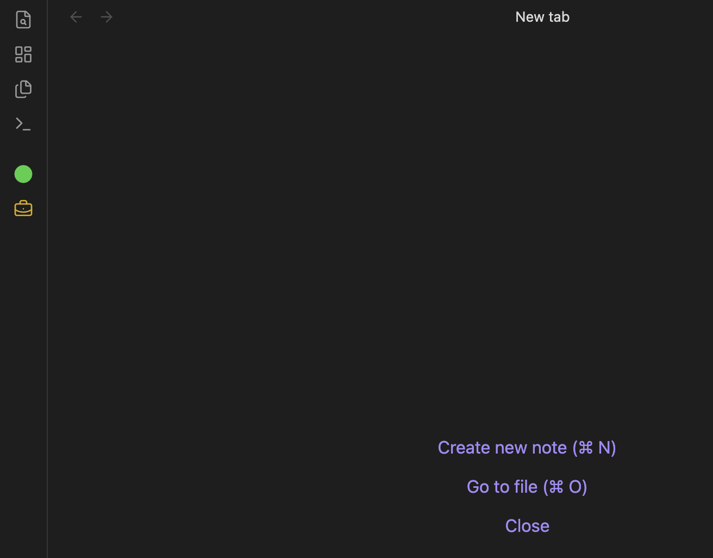
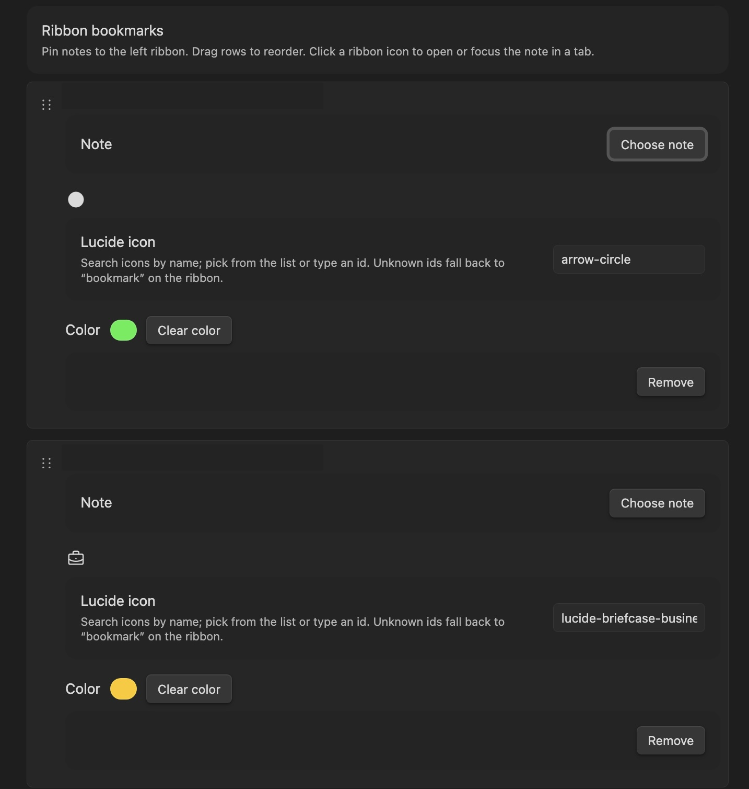

# Ribbon Bookmarks

Obsidian plugin (desktop only) that pins vault notes to the **left ribbon** as **Lucide** icons. You can add many bookmarks, pick an icon and hex color for each, and reorder them in settings. Clicking a ribbon icon **opens the note in a new tab**, or **focuses the tab** if that note is already open.




## Support

If you find this plugin helpful, consider supporting my work!

[](https://buymeacoffee.com/jason_unix)


## Requirements

- **Obsidian** 1.11.7 or newer  
- **Desktop** (Windows, macOS, or Linux). This plugin is not intended for mobile.

## What it does

- **Settings → Ribbon Bookmarks**: manage a list of bookmarks. Each row has:
  - **Choose note** — pick a markdown note in the vault  
  - **Lucide icon** — any icon id from Obsidian’s built-in Lucide set (invalid names fall back to `bookmark`)  
  - **Color** — optional hex color for the ribbon icon (or clear to use the theme default)  
  - **Remove** — delete that bookmark  
- **Drag and drop** rows to change order; the ribbon updates to match.  
- **Tooltip** on each ribbon icon shows the note name (from the file). If the file is missing, the tooltip includes **(missing)**; clicking still shows a notice.  
- **Rename / delete in the vault**: renames update the stored path when possible; deleted files stay in the list until you remove the bookmark, with a clear missing-file notice on click.

Data is stored in the plugin’s `data.json` under the vault’s plugin folder (no import/export in this version).




## Install from source

1. Clone or copy this repository.  
2. Install dependencies and build:

   ```bash
   npm install
   npm run build
   ```

   This produces `main.js` in the project root.

3. Copy the whole plugin folder into your vault:

   ```text
   <Vault>/.obsidian/plugins/ribbon-bookmarks/
   ```

   Include at least:

   - `main.js`  
   - `manifest.json`  
   - `styles.css`  

4. Restart Obsidian or reload plugins, then enable **Ribbon Bookmarks** under **Settings → Community plugins**.

### Development

Run `npm run dev` to watch and rebuild `main.js` while you work. Point your vault’s plugin folder at this project (or symlink it) so changes reload quickly.

## Publish to Obsidian Community Plugins

Follow the official guide: **[Submit your plugin](https://docs.obsidian.md/Plugins/Releasing/Submit+your+plugin)**.

1. **Build release artifacts** (from this repo):

   ```bash
   npm install && npm run build
   ```

2. **Create a GitHub release** on [JasonBerto/obsidian_ribbon_bookmarks](https://github.com/JasonBerto/obsidian_ribbon_bookmarks):

   - **Tag**: use the same version as `manifest.json` (e.g. `1.0.0`), **without** a `v` prefix.
   - **Attach these files** as release assets: `main.js`, `manifest.json`, `styles.css` (from the project root after build).

3. **Open a pull request** to add your plugin to the directory:

   - Fork [obsidianmd/obsidian-releases](https://github.com/obsidianmd/obsidian-releases).
   - Edit `community-plugins.json` and append an entry like:

     ```json
     {
       "id": "ribbon-bookmarks",
       "name": "Ribbon Bookmarks",
       "author": "Jason Bert",
       "description": "Pin notes to the ribbon as Lucide icons with custom colors. Click opens or focuses the note in a tab.",
       "repo": "JasonBerto/obsidian_ribbon_bookmarks"
     }
     ```

   - Title the PR: `Add plugin: Ribbon Bookmarks` (see the docs for the exact convention).

After review, the plugin will appear under **Settings → Community plugins** in Obsidian.

## License

Licensed under the MIT License. See [LICENSE.md](LICENSE.md).
